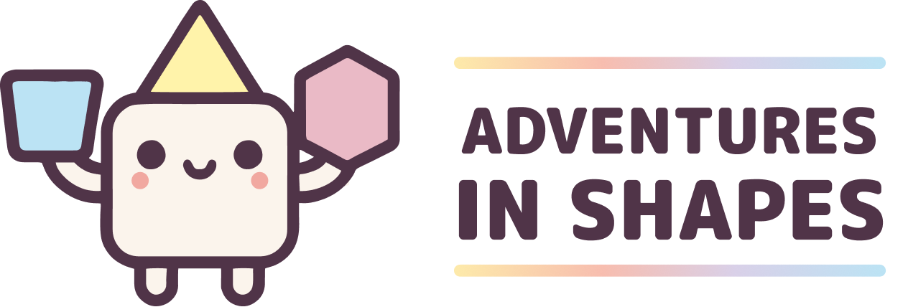

# Adventure in Shapes

## Introdução

**Adventure in Shapes** é um aplicativo divertido e interativo focado em formas geométricas. O objetivo principal é ajudar os usuários a calcular diferentes propriedades geométricas, como área, perímetro, raio e mais, de várias formas geométricas. O app é projetado para ser educativo e envolvente, utilizando dois personagens interativos para guiar os usuários nesse mundo de aventura geométrica.

### Características Principais:

- **Cálculo de Áreas**: Cálculo da área de diversas formas geométricas, incluindo quadrados, retângulos, triângulos, círculos, polígonos e outras formas complexas.
- **Cálculo de Perímetros**: Oferece opções para calcular o perímetro de formas específicas com diferentes tamanhos e proporções.
- **Cálculo de Raio e Diâmetro**: Fornece suporte para o cálculo de raio e diâmetro de figuras circulares, facilitando a visualização dos cálculos.
- **Escolha de Personagens**: Dois personagens carismáticos, Sunny e Pinky, são apresentados para tornar a experiência mais divertida e envolvente.
- **Interatividade**: Jogos e mini-desafios interativos para ajudar os usuários a fixar conceitos básicos de geometria.
- **Interface Amigável**: Layout elegante e intuitivo, adaptado para diferentes dispositivos, desde smartphones até tablets.
- **Progressão Guiada**: As atividades são organizadas de forma a proporcionar um aprendizado passo a passo, com feedback dinâmico para cada cálculo realizado.

### Tecnologias Usadas

- **Kotlin** para desenvolvimento Android.
- **Jetpack Compose** para criação de interfaces visuais modernas e responsivas.
- **Android Navigation** para navegação entre telas e otimização da experiência do usuário.
- **Material3** para componentes visuais bonitos e funcionais.

### 🚨 Aviso de Direitos Autorais

📌 *Copyright (c) 2025 Andressa Prudente (@dessadev)*  
Este projeto é protegido por direitos autorais. A cópia, modificação ou distribuição sem permissão são proibidas.  

Se precisar de permissão para uso, entre em contato:  
🔗 [GitHub: dessadev](https://github.com/dessadev)
